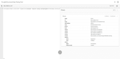

ejelome.com
===========

My [homepage](https://ejelome.com)

-------------------------------------------------------------------------------

<!-- markdown-toc start - Don't edit this section. Run M-x markdown-toc-refresh-toc -->
**Table of Contents**

- [ejelome.com](#ejelomecom)
    - [src](#src)
        - [Features](#features)
            - [Main](#main)
            - [Others](#others)
        - [Dependencies](#dependencies)
        - [Setup](#setup)
        - [Build](#build)
        - [Clean](#clean)
        - [Run server](#run-server)
            - [Development](#development)
            - [Production](#production)
    - [docs](#docs)
        - [Dependencies](#dependencies-1)
        - [Setup](#setup-1)
        - [Build](#build-1)
        - [Server](#server)
    - [slides](#slides)
        - [Setup](#setup-2)
        - [Build](#build-2)
        - [Server](#server-1)
    - [License](#license)

<!-- markdown-toc end -->

-------------------------------------------------------------------------------

src
---

`./src/` contains the files required to render the homepage.

### Features ###

#### Main ####

| Feature        | Screenshots                                                                                                                                                                                                                                                                                     | Topic                                                                                        | Reference                                                                                              |
| :------------- | :---------------------------------------------------------------------------------------------------------------------------------------------------------------------------------------------------------------------------------------------------------------------------------------------- | :------------------------------------------------------------------------------------------- | :----------------------------------------------------------------------------------------------------- |
| Data           | <a href="./screenshots/sdtt.png" title="Sdtt"></a>                                                                                                                                                                                                        | [SEO](https://en.wikipedia.org/wiki/Search_engine_optimization "Search Engine Optimization") | [Structured Data Testing Tool](https://search.google.com/structured-data/testing-tool#url=ejelome.com) |
| Speed          | <a href="./screenshots/gtmetrix.png" title="Gtmetrix"></a>                                                                                                                                                                                            | [WPO](https://en.wikipedia.org/wiki/Web_performance "Web performance optimization")          | [GTmetrix](https://gtmetrix.com/reports/ejelome.com/9UfsH1kp)                                          |
| Contrast       | <a href="./screenshots/wave.png" title="Wave"></a>                                                                                                                                                                                                        | [Web accessibility](https://en.wikipedia.org/wiki/Web_accessibility)                         | [WAVE](https://wave.webaim.org/report#/https://ejelome.com)                                            |
| Semantics      | <a href="./screenshots/semantic.png" title="Semantic"></a>                                                                                                                                                                                            | [Semantic HTML](https://en.wikipedia.org/wiki/Semantic_HTML)                                 | [Homepage (view-source)](https://ejelome.com)                                                          |
| Responsive     | <a href="./screenshots/mobile.png" title="Mobile"></a> <a href="./screenshots/tablet.png" title="Tablet"></a> <a href="./screenshots/desktop.png" title="Desktop"></a> | [Web usability](https://en.wikipedia.org/wiki/Web_usability)                                 | [Homepage](https://ejelome.com)                                                                        |

#### Others ####

- [html5-boilerplate](https://github.com/h5bp/html5-boilerplate) (structure and [index.html](https://github.com/h5bp/html5-boilerplate/blob/master/dist/index.html) only)
- [Rel=Canonical](https://support.google.com/webmasters/answer/139066?hl=en)
- [favicon](https://realfavicongenerator.net)
- [Google Fonts](https://fonts.google.com) ([Pacifico](https://fonts.google.com/specimen/Pacifico), [Lobster Two](https://fonts.google.com/specimen/Lobster+Two) and [Ubuntu Mono](https://fonts.google.com/specimen/Ubuntu+Mono))
- [Tachyons](https://tachyons.io)
- [Font Awesome](https://fontawesome.com)
- [JSON-LD](https://json-ld.org) ([schema.org/Person](https://schema.org/Person))
- [Google Analytics](https://analytics.google.com)
- [Creative Commons](https://creativecommons.org)

-------------------------------------------------------------------------------

### Dependencies ###

- [jq](https://stedolan.github.io/jq)
- [html-minifier](https://github.com/kangax/html-minifier)
- [clean-css](https://github.com/jakubpawlowicz/clean-css)
- [uglify-js](https://github.com/mishoo/UglifyJS2)
- [relateurl](https://github.com/stevenvachon/relateurl)
- [css-cli](https://github.com/css/csso-cli)
- [imagemin-cli](https://github.com/imagemin/imagemin)

### Setup ###

``` shell
$ yay -S jq
$ npm install -g html-minifier \
               clean-css       \
               uglify-js       \
               relateurl       \
               csso-cli        \
               imagemin-cli
```

### Build ###

``` shell
$ make
```

### Clean ###

``` shell
$ make clean
```

### Run server ###

#### Development ####

View un-optimized homepage.

``` shell
$ make dev-server
```

#### Production ####

View optimized homepage.

``` shell
$ make server
```

-------------------------------------------------------------------------------

docs
----

`./docs/` contain technical documentation.

_See: [docs.ejelome.com](https://docs.ejelome.com)._

### Dependencies ###

- [pipenv](https://pipenv.kennethreitz.org)

### Setup ###

``` shell
$ cd docs/       # change directory to docs/
$ pipenv shell   # activate virtualenv using Python v3.8+
$ pipenv install # install dependencies
```

### Build ###

``` shell
$ make html # generate html docs
```

### Server ###

``` shell
$ make server
```

-------------------------------------------------------------------------------

slides
------

`./docs/source/_misc/slides/` contain software development HTML slideshows.

_See: [docs.ejelome.com/slides](https://docs.ejelome.com/slides)._

### Setup ###

_See [Reveal.js with Org layer](https://docs.ejelome.com/slides/revealjs-with-org-layer.html)'s steps [3](https://docs.ejelome.com/slides/revealjs-with-org-layer.html#/3) and [4](https://docs.ejelome.com/slides/revealjs-with-org-layer.html#/4)._

### Build ###

_See [Reveal.js with Org layer](https://docs.ejelome.com/slides/revealjs-with-org-layer.html)'s step [5](https://docs.ejelome.com/slides/revealjs-with-org-layer.html#/5)._

### Server ###

``` shell
$ make prep-slides  # prepare slides
$ make serve-slides # go to slides list
```

-------------------------------------------------------------------------------

License
-------

`ejelome.com` is licensed under [MIT](./LICENSE).
